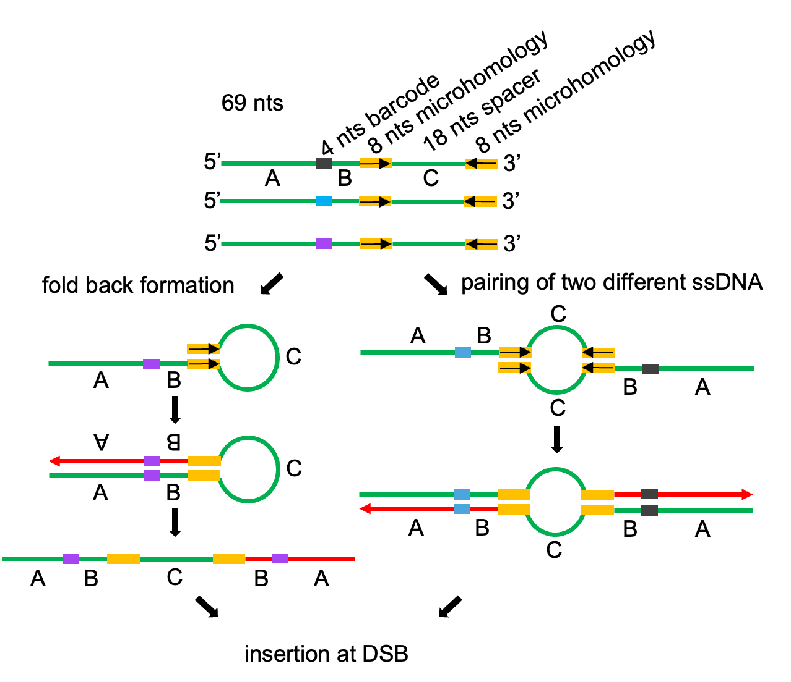

# iDSBInvert
Templated insertions can occur at programmed breaks at VDJ locus or at endonuclease induced breaks (3,5,12,45). Despite their prevalence, the mechanisms underlying such events remain poorly understood, and the genetic pathways regulating these events are largely unknown. We propose that such inversions arise through microhomology mediated template switch within single-stranded DNA intermediates of replication, followed by displacement of inverted sequence and its insertion at the DSB. The package is to characterize the inverted repeats from ssDNA transformation to undestand the mechanism.

## Method
1. Technology design
<p align="center">
 

To directly understand what the inverted insertion mechanism, we transformed 69 nucleotides long single-stranded DNA (ssDNA) carrying an 8-nucleotide long internal inverted microhomology into wild-type cells. To distinguish between inversions generated by two molecules and those within a single molecule, we added random internal 4-nucleotide barcodes to the transformed DNA. Inversions formed within a single molecule would carry two identical barcodes, while inversions formed between two molecules would carry two different barcodes, with four nucleotide barcodes providing 256 possible combinations.

2. Bioinformatic analyses
   
Raw reads were pre-processed with quality control and merged with PEAR v0.9.111 as described above. Reads with any substring of transformed ssDNA (e.g., CATTGAACAA, CAACATGTTG, TTGCTGTAAG, ACTCATAGTA, GTGTATCTGG, TACCAGATAC, TACTATGAGT, or CTTACAGCAA) were recognized as insertions with ssDNA. UMI sequences were defined between 5bp upstream and 5bp downstream seed sequences (GTAAG (….) ACTCA, and TGAGT (….) CTTAC). Perfect matches were required for these seed sequences. Thereafter, UMI features were used to distinguish between a sequencing duplication of one unique insertion versus two independent insertions. In brief, we only considered the reads with identical UMIs and junction sequences (between HO and insertions) as duplicated reads. If with any difference of either the UMIs or the junction sequences, these inserted reads were as independent events. If the unique events cannot be solved by UMIs, we used BLASTN results for the deduplication as the method described above. For other unclassified reads, i.e., without any UMI or with erroneous UMIs, we performed the BLASTN to build a duplication index, in which two reads were clustered when had >95%, <= 2 mismatches and 2 gap size, and can span 95% of read length. Notably, among the duplications of ssDNA inserts, we selected one pair of reads with highest read quality to represent each unique event. To further characterize two possible mechanisms of the inverted repeats at DSBs, we specifically concentrated on the insertion events that have two clear 4bp UMIs at each side. These insertions with complementary UMIs were retrieved as fold back (inter ssDNA), whereas others were as two different ssDNA (intra ssDNA).


##  Availability 
1. Detect reads with transformed ssDNA
2. Define the unique event of transformed ssDNA
3. Characterize possible mechanisms


## Dependencies

Perl is used to run the scripts. The following softwares are also required:

1. bwa
2. bbduk
3. pear
4. blastn

## Usage

````
sh iDSBinvert -a Sample ID -b Work Directory  -f Insertion events -r Output  -p Software installed Directory
````

# Contact


For more detail information, please feel free to contact: xin.wang@childrens.harvard.edu

This project is licensed under the terms of the MIT license.

Copyright (c) 2023 Dr. Kaifu Chen lab

Current version v1.0


